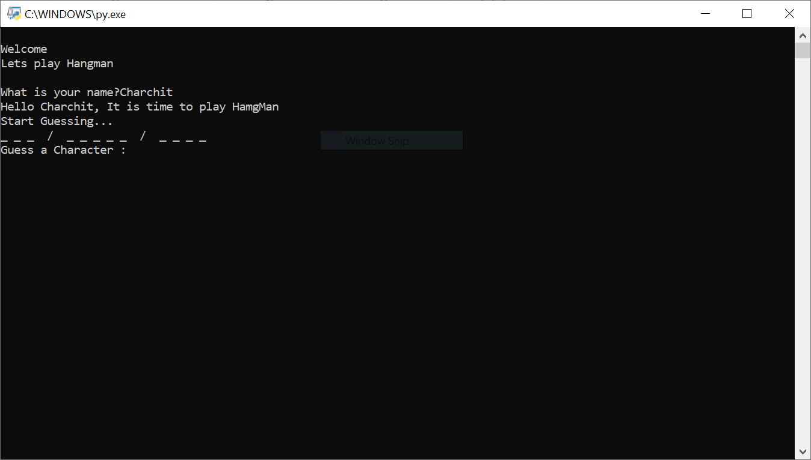
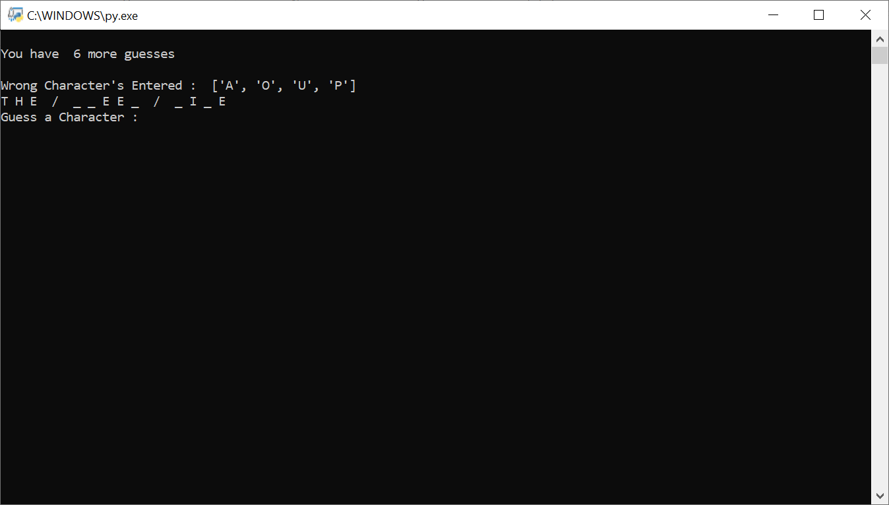

# Hangman Game

A Python implementation of the classic word-guessing game Hangman, built as part of my journey to learn Python programming fundamentals.

## About This Project

I created this project to practice core Python concepts including:
- String manipulation and character handling
- Conditional logic and loop structures
- Random selection from data collections
- User input validation and feedback
- Terminal-based user interfaces

The game features a clean, text-based interface that runs in the terminal, making it accessible on any system with Python installed.

## Features

- Randomly selected words from various categories
- Visual ASCII representation of the hangman
- Letter guessing with immediate feedback
- Limited number of attempts with clear tracking
- Win/lose condition monitoring
- Option to play again after game completion

## Screenshots




## How to Play

1. Run the script:
   ```
   python hangman.py
   ```

2. The game will select a random word and display it as underscores
3. Guess one letter at a time by typing it and pressing Enter
4. If the letter is in the word, it will be revealed in its correct position(s)
5. If the letter is not in the word, a part of the hangman will be drawn
6. Continue guessing letters until you either:
   - Correctly guess all the letters in the word (win)
   - Complete the hangman drawing after too many incorrect guesses (lose)

## Game Rules

- Each incorrect guess adds a part to the hangman
- You have a limited number of incorrect guesses (10 attempts)
- You can only guess one letter at a time
- Repeated guesses of the same letter don't count as additional attempts

## What I Learned

This project helped me understand:
- How to structure a simple game loop
- Techniques for handling and validating user input
- Working with random selections
- Managing game state between turns
- Creating a responsive terminal UI experience

## Future Improvements

I plan to enhance this project by:
- Adding difficulty levels with different word categories
- Implementing a graphical interface using Tkinter
- Adding hints for particularly difficult words
- Creating a scoring system based on word difficulty and attempts used
- Supporting multiplayer mode where players can add their own words

## Requirements

- Python 3.x
- No external libraries required (uses only Python standard library)


