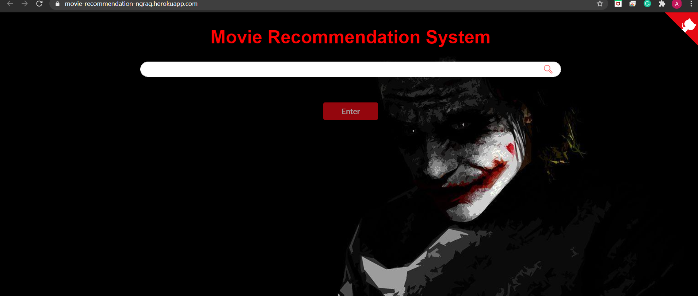

# Advanced Movie Recommendation System

A sophisticated Flask-based application that recommends movies based on content similarity and performs sentiment analysis on user reviews, built to explore machine learning concepts and web development.



## Project Journey

I created this project to dive deeper into:
- Recommendation systems and their underlying algorithms
- Natural Language Processing for sentiment analysis
- Web application development with Flask
- Integration of machine learning models into web applications
- Frontend and backend interaction in a data-driven application

This system represents my exploration of both theoretical concepts and practical implementation of recommendation engines, which are at the heart of many popular services like Netflix, Amazon, and Spotify.

## Key Features

- **Content-Based Recommendation Engine**: Suggests similar movies using cosine similarity on movie features
- **Sentiment Analysis**: Processes user reviews from IMDB and classifies them as positive or negative
- **Interactive Search**: Autocomplete-enabled search functionality for a smooth user experience
- **Comprehensive Movie Information**: Displays cast details, ratings, release dates, and more
- **Responsive UI**: Modern interface that adapts to different screen sizes
- **Error Handling**: Robust error management with custom error pages

## Technical Implementation

### Recommendation Engine

The core of this system uses **cosine similarity** to find content-based relationships between movies. The process involves:

1. **Vectorization**: Converting movie attributes (plot, genre, etc.) into numerical vectors
2. **Similarity Calculation**: Computing the cosine similarity between these vectors
3. **Ranking**: Sorting movies by similarity score to provide relevant recommendations

This approach allows the system to find thematically similar movies even when they don't share actors or directors.

### Sentiment Analysis

The application analyzes user reviews using Natural Language Processing:

1. **Text Processing**: Cleaning and preparing review text
2. **Vectorization**: Converting text to numerical features
3. **Classification**: Using a machine learning model to determine sentiment
4. **Visualization**: Presenting sentiment results alongside reviews

### Technologies Used

- **Backend**: Flask, Python 3.6+
- **Data Processing**: NumPy, Pandas
- **Machine Learning**: scikit-learn for vectorization and modeling
- **Web Scraping**: BeautifulSoup4 for gathering user reviews
- **Frontend**: HTML5, CSS3, Bootstrap, JavaScript/jQuery
- **Data Storage**: CSV for movie data, Pickle for serialized models

## What I Learned

This project significantly improved my understanding of:

- Vector space models and similarity metrics
- Text processing and feature extraction
- Integration of ML models into web applications
- API design and asynchronous requests
- Error handling in production environments
- User experience design for data-driven applications

## Setup and Installation

### Prerequisites

- Python 3.6 or higher
- pip (Python package installer)

### Installation Steps

1. Clone this repository:
   ```
   git clone <repository-url>
   cd movie-recommendation
   ```

2. Install required packages:
   ```
   pip install -r requirements.txt
   ```

3. Create model files (if not already present):
   ```
   python create_dummy_files.py
   ```

4. Run the application:
   ```
   python main.py
   ```

5. Open your browser and navigate to:
   ```
   http://127.0.0.1:5000/
   ```

## Project Structure

- `main.py`: Flask application containing routes and core logic
- `main_data.csv`: Dataset of movies with features for similarity calculation
- `nlp_model.pkl`: Trained model for sentiment analysis
- `tranform.pkl`: Text vectorizer for NLP processing
- `templates/`: HTML templates for the web interface
- `requirements.txt`: Project dependencies

## Usage Guide

1. Enter a movie title in the search bar on the home page
2. Select a movie from the autocomplete suggestions
3. Explore movie details including plot, cast, and ratings
4. Browse similar movie recommendations
5. Read user reviews with sentiment analysis results

## Challenges and Solutions

- **API Rate Limiting**: Implemented delays between requests to respect external API limits
- **Data Processing**: Created efficient data transformation pipelines for movie features
- **User Experience**: Designed an intuitive interface with immediate feedback
- **Error Handling**: Developed comprehensive error pages and logging

## Future Improvements

I plan to enhance this project by:
- Implementing collaborative filtering to complement content-based recommendations
- Adding user accounts to track viewing history and preferences
- Integrating with a live movie database API for up-to-date information
- Developing a recommendation explanation system
- Creating a mobile application version

## Acknowledgments

- Inspired by recommendation systems in commercial platforms
- Built with Flask for its simplicity and flexibility
- Utilized machine learning concepts from various online resources

